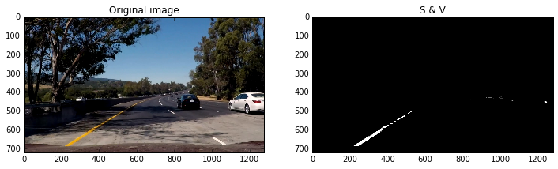
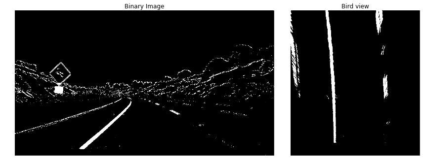
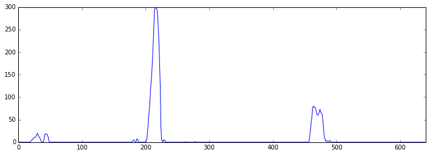

# Advanced Lane Finding

## Introduction
Finding the lane is important for the car to know where to drive.  Although P1 already provided some experiments on lane finding, the techniques used in P1 were canny  and hough transformation by which we can only detect straight lines.

In this project, advanced techniques, like camera calibration, perspective transformation, sliding window searching, sobel filter and HSV color space, are used to detect lane more accurately. The following is an example.

<center>  </center>

## Camera Calibration
Camera calibration is to get the distortion parameters and perspective transforation matrix.
With the common cheap pinhole camera, there is usually significant distortion. OpenCV takes into account the radial and tangential distortion. 

A image is took by projecting 3D points into image plane by a perspective transformation which is composed with the camera mtraix, or the matrix of instrisc parameters and extrinsic parameters. The intrinsic parameters are determined by the camera, but the extrinsic parameters are also affected by world coordinates.

OpenCV is used to get distortion coeffients and camera matrix. The black-white chessboard method is used. Firstly cv2.findChessboard function can find all the corners of chessboard in image and cv2.cornerSubPix will help fine the coordinates. Secondly cv2.calibrateCamera will get the distortion coeffient and camera matrix. Thirdly cv2.getOptimalNewCameraMatrix with alpha set to zero to get a new camera matrix. All the three part parameters are stored in a file for later use.

<center></center>

## Pipeline
### Distortion correction
Already get the camera matrix and distortion parameters, every captured frame should be transformed to compensate distortion. The following are the code and frames before and after undistorted. They are not apprent like the chessboard, but the diffence can be got by substracting them.
```
img_undist = cv2.undistort(image, camera_mtx, dist_coeff, None, new_camera_mtx)
```
<center></center>

### Binary image generation
It is time to appy color threshold and sobel filter to generate a binary image which includes lane pixel. 

The following is the filter functions.
```python
def sobel_filter(image_gray, orient='x', kern_size = 3, thresh=(0, 255)):
    # Calculate directional gradient
    # Apply threshold
    if orient == 'x':
        sobel_img = cv2.Sobel(image_gray, cv2.CV_64F, 1, 0, ksize=kern_size)
    elif orient == 'y':
        sobel_img = cv2.Sobel(image_gray, cv2.CV_64F, 0, 1, ksize=kern_size)
    
    sobel_img = np.abs(sobel_img)
    scaled_sobel = np.uint8(255 * sobel_img/np.max(sobel_img))
    grad_binary = np.zeros_like(image_gray)
    grad_binary[( scaled_sobel >= thresh[0] ) & (scaled_sobel <= thresh[1])] = 1
    return grad_binary

def mag_filter(image_gray, kern_size = 3, thresh=(0, 255)):
    # Calculate gradient magnitude
    # Apply threshold
    sobelx = cv2.Sobel(image_gray, cv2.CV_64F, 1, 0, ksize=kern_size)
    sobely = cv2.Sobel(image_gray, cv2.CV_64F, 0, 1, ksize=kern_size)
    
    mag = np.sqrt(sobelx ** 2 + sobely ** 2)
    scaled_mag = np.uint8(255 * mag/np.max(mag))
    
    mag_binary = np.zeros_like(sobelx)
    mag_binary[(scaled_mag >= thresh[0]) & (scaled_mag <= thresh[1])] = 1
    
    return mag_binary

def direct_filter(image_gray, kern_size = 3, thresh=(0, np.pi/2)):
    # Calculate gradient direction
    # Apply threshold
    sobelx = cv2.Sobel(image_gray, cv2.CV_64F, 1, 0, ksize=kern_size)
    sobelx = np.abs(sobelx)
    sobely = cv2.Sobel(image_gray, cv2.CV_64F, 0, 1, ksize=kern_size)
    sobely = np.abs(sobely)
    
    direct_value = np.arctan2(sobely, sobelx)
    direct_binary = np.zeros_like(sobelx)
    
    direct_binary[(direct_value > thresh[0]) & (direct_value < thresh[1])] = 1
    return direct_binary
```
Most filters are just copied from Udacity. But the sat_filter is changed to overcome the shadow of tree. In fact sat_filter combine the staturation filter and brightness filter. 
```
def sat_filter(image, s_threshold=(120,255)):
    hsv = cv2.cvtColor(image, cv2.COLOR_RGB2HSV).astype(np.float)
    s_channel = hsv[:, :, 1]
    v_channel = hsv[:, :, 2]
    
    #clear the higher part half of image v_channel which is sky
    img_h, img_w = v_channel.shape
    v_channel[:img_h//2, :] = 0
    
    # rescale with the lower part
    v_channel = (255 * v_channel/np.max(v_channel))

    #combine them together
        
    combined = np.zeros_like(s_channel)
    combined[ ((s_channel >= s_threshold[0]) & (s_channel <= s_threshold[1]) & \
             (v_channel > 125.5)) ] = 1
    
    return combined
```
For example, the following is only the saturation channel throldholded with [120, 255]. The back of black car and shadow of tree are also included.
<center></center>
After apply brithness threshold on value channel and combine it with thresholded saturation channel, only the yellow line is left:
<center></center>

Then combine staturation, magnitude, direction and sobel thresholded, get a final binary image.
```
    s_th=(120, 255)
    s_bin = sat_filter(image, s_threshold = s_th)

    img_gray = cv2.cvtColor(image, cv2.COLOR_RGB2GRAY)
    
    sobel_kern = 5
    sobel_th = (50, 150)
    sobelx_bin = sobel_filter(img_gray, orient='x', kern_size=sobel_kern, thresh=sobel_th)
    sobely_bin = sobel_filter(img_gray, orient='y', kern_size=sobel_kern, thresh=sobel_th)
    
    mag_kern = 9
    mag_th = (50, 255)
    mag_bin = mag_filter(img_gray, kern_size=mag_kern, thresh=mag_th)
    
    dir_kern = 5
    dir_th = (0.7, 1.3)
    direct_bin = direct_filter(img_gray, kern_size=dir_kern, thresh=dir_th)
    
    combined_bin = np.zeros_like(img_gray)
    combined_bin[ (s_bin==1) | ((sobelx_bin==1) & (sobely_bin==1)) \
                 | ((mag_bin==1) & (direct_bin==1))] = 1
```
The visualized binary image is following:
<center></center>

### Perspective transform
In order to find lane on a binary image, it is better to transform it to a bird-eye view. The straight_lines1.jpg is undistored first. Four points are selected manually on left and right lines as source points, then define four new points in bird-eye view as destination. The four points in the bird-eye view form rectangle corners. cv2.getPerspectiveTransform is called to calculate the perspective transform matrix. One of the advantage of bird-eye view is most unrelated part in image disappeared, then it is easy to search the lanes.
<center></center>
The perspective matrix can be used to warp other images, like below:
<center></center>
### Find lanes
Although the lane is very obvious in the bird-eye view, but we need to find the pixel location of the lane. The method to find lane for the first frame and following frame are different. The blind search method is choosed for the first frame.
#### First frame
Take a histogram of the half part of the binary image to find the start point of lane. The peak location of the left half is the left lane starting point, and the right half is the same.
<center></center>
```python
        img_h, img_w = image.shape
        window_height = img_h//self.nwindows
        
        hstg = np.sum(image[img_h//2:, :], axis=0)
  
        midpoint = img_w//2
        leftx_base = np.argmax(hstg[:midpoint])
        rightx_base = np.argmax(hstg[midpoint:]) + midpoint
```
Once we found the starting point of the lane, a search window in size 60x36 is placed for each lane. The starting point is at the middle of the bottom of the search window. All the pixels in the search window is recorded. The histogram of pixels in window is calculated. The new peak location is the middle of the bottom of the next search window. Repeat the process until the whole image is searched and all pixels in the series of search window is recored. It looks like this:
<center></center>
With all the pixels found in all the search window, we can call numpy.polyfit function to fit a best quadratical polynomial which is draw in green line above. Of cource, left and right lane has its indepedent polynomial.
After get the lanes and polynomial, we can paint the road the tranfrom back into the orignal frame. 
```python
    def lane_search(self, image):
        img_h, img_w = image.shape
        window_height = img_h//self.nwindows
        
        hstg = np.sum(image[img_h//2:, :], axis=0)
        
        
        midpoint = img_w//2
        leftx_base = np.argmax(hstg[:midpoint])
        rightx_base = np.argmax(hstg[midpoint:]) + midpoint
    
        nonzero = image.nonzero()
        nonzeroy = nonzero[0]
        nonzerox = nonzero[1]
        
        leftx_current = leftx_base
        rightx_current = rightx_base
                                
        left_lane_inds = []
        right_lane_inds = []
        
        img_out = np.dstack((np.zeros_like(image), np.zeros_like(image), \
                             np.zeros_like(image)))*255
        for window in range(self.nwindows):
            win_y_low = img_h - (window + 1)*window_height
            win_y_high = img_h - window * window_height
            
            win_xleft_low = leftx_current - self.margin
            win_xleft_high = leftx_current + self.margin
            
            win_xright_low = rightx_current - self.margin
            win_xright_high = rightx_current + self.margin
        
            #cv2.rectangle(img_out, (win_xleft_low, win_y_low), 
            #              (win_xleft_high, win_y_high), (0, 255, 0), 2)
            #cv2.rectangle(img_out, (win_xright_low, win_y_low), 
            #              (win_xright_high, win_y_high), (0, 255, 0), 2)
        
            good_left_inds = ((nonzeroy >= win_y_low) & (nonzeroy < win_y_high) & 
                          (nonzerox >= win_xleft_low) & (nonzerox < win_xleft_high)).nonzero()[0]
            good_right_inds = ((nonzeroy >= win_y_low) & (nonzeroy < win_y_high) &
                           (nonzerox >= win_xright_low) & (nonzerox < win_xright_high)).nonzero()[0]
        
            left_lane_inds.append(good_left_inds)
            right_lane_inds.append(good_right_inds)
        
            if len(good_left_inds) > self.minpix:
                leftx_current = np.int(np.mean(nonzerox[good_left_inds]))
            if len(good_right_inds) > self.minpix:
                rightx_current = np.int(np.mean(nonzerox[good_right_inds]))
            
        left_lane_inds = np.concatenate(left_lane_inds)
        right_lane_inds = np.concatenate(right_lane_inds)
    
        leftx = nonzerox[left_lane_inds]
        lefty = nonzeroy[left_lane_inds]
        ret_l, left_fit = self.left.fit((img_w, img_h), leftx, lefty)
        
        rightx = nonzerox[right_lane_inds]
        righty = nonzeroy[right_lane_inds]
        
        ret_r, right_fit = self.right.fit((img_w, img_h), rightx, righty)
        
        if ret_l is False or ret_r is False:
            left_fit, right_fit = self.adjust_fit(left_fit, ret_l, right_fit, ret_r)
        
        
        # find indice for the whole image
        whole_img = np.indices((img_h, img_w))
        imgx= whole_img[1].flatten()
        imgy = whole_img[0].flatten()
        
        #print('imgx shape {}, imgy shape {}'.format(imgx.shape, imgy.shape))
        # got indice between left lane and right lane
        lane_inds = ((imgx >= (left_fit[0]*(imgy**2) + left_fit[1] * imgy + left_fit[2])) 
                        & (imgx < (right_fit[0]*(imgy**2) + right_fit[1] * imgy + right_fit[2])))
        # paint the lane to green
        
        img_out[imgy[lane_inds], imgx[lane_inds]] = [0, 255, 0]
        
        
        ploty = np.linspace(0, img_out.shape[0]-1, img_out.shape[0])
        plot_leftx = np.int_(left_fit[0]*(ploty**2) + left_fit[1]*ploty + left_fit[2])
        plot_leftx = np.clip(plot_leftx, 0, img_out.shape[1] - 1, plot_leftx)
        plot_rightx = np.int_(right_fit[0]*(ploty**2) + right_fit[1]*ploty + right_fit[2])
        plot_rightx = np.clip(plot_rightx, 0, img_out.shape[1] -1, plot_rightx)
        
        img_out[np.int_(ploty), plot_leftx] = [0, 255, 0]
        img_out[np.int_(ploty), plot_rightx] = [0, 255, 0]
        
        
        #paint left track to Red, right track to green
        img_out[nonzeroy[left_lane_inds], nonzerox[left_lane_inds]] = [255, 0, 0]
        img_out[nonzeroy[right_lane_inds], nonzerox[right_lane_inds]] = [0, 0, 255]
    
        return img_out
```
#### following frames
After we find the lanes on the first image, the fitted ploynomial will be used to calculated a base line. A margin of 30 pixels around the base line will form a search area in the following frame. With the pixels in the search area, a new quadratic polynomial is fitted. Repeat the process to search the whole frame.
If the image is not the first frame, addtioanl checking is applied:
1. whether the slope of point on the lane with y value 660 has a angle of almost 90 degree. If the difference is bigger than 5 degree, the lane is given up.
2.  If the third value of fit array, which is the lane at the upper edge of bird-eye view, has a shift over 100, the lane is given up.
If the lane is given up, five previous lanes will be averaged to used as the default lane. If there are 3 continuous lane are given up, a blind search is conducted.

```python
    def lane_match(self, image):
        left_fit = self.left.fit_params
        right_fit = self.right.fit_params
        
        img_h, img_w = image.shape
        nonzero = image.nonzero()
        nonzerox = nonzero[1]
        nonzeroy = nonzero[0]
    
        left_lane_inds = ((nonzerox > (left_fit[0]*(nonzeroy**2) + left_fit[1] * nonzeroy
                       + left_fit[2] - self.margin)) & (nonzerox < (left_fit[0] * (nonzeroy**2) + 
                       left_fit[1] * nonzeroy + left_fit[2] + self.margin)))
    
        right_lane_inds = (((nonzerox > right_fit[0]*(nonzeroy**2) + right_fit[1]* nonzeroy
                        + right_fit[2] - self.margin)) & (nonzerox < (right_fit[0] * (nonzeroy**2) + 
                        right_fit[1] * nonzeroy + right_fit[2] + self.margin)))
        
        leftx = nonzerox[left_lane_inds]
        lefty = nonzeroy[left_lane_inds]
        rightx = nonzerox[right_lane_inds]
        righty = nonzeroy[right_lane_inds]
    
        #left_fit = np.polyfit(lefty, leftx, 2)
        #right_fit = np.polyfit(righty, rightx, 2)
        ret_l, left_fit = self.left.fit((img_w, img_h), leftx, lefty)
        ret_r, right_fit = self.right.fit((img_w, img_h), rightx, righty)
        
        if ret_l is False or ret_r is False:
            left_fit, right_fit = self.adjust_fit(left_fit, ret_l, right_fit, ret_r)
        
        img_out = np.dstack((np.zeros_like(image), np.zeros_like(image), \
                             np.zeros_like(image)))*255
    
        whole_img = np.indices((img_h, img_w))
        imgx= whole_img[1].flatten()
        imgy = whole_img[0].flatten()
        
        lane_inds = ((imgx >= (left_fit[0]*(imgy**2) + left_fit[1] * imgy + left_fit[2])) 
                        & (imgx < (right_fit[0]*(imgy**2) + right_fit[1] * imgy + right_fit[2])))
        img_out[imgy[lane_inds], imgx[lane_inds]] = [0, 255, 0]
        
        img_out[nonzeroy[left_lane_inds], nonzerox[left_lane_inds]] = [255, 0, 0]
        img_out[nonzeroy[right_lane_inds], nonzerox[right_lane_inds]] = [0, 0, 255]
        return img_out
```
### Curvature and distance
The curvature of lane is calculated in term of the formula. The value of x and y should be converted from pixel to measurement in meter. The following is fucntion calculating the curvature of the lane. The radius is the reciprocal of curvature.
```python
    def cal_curva(self, py):
        fit_rw = np.polyfit(self.ally*self.mppy, self.allx*self.mppx, 2)
        py_rw = py * self.mppy
        curva = (2.0*fit_rw[0]) / ((1.0 + (2*fit_rw[0]*py_rw+fit_rw[1])**2)**1.5)
        return curva
```
About the position of the vehicle, we can calculate the offset between the middle of two lanes and the center of the image,

### The final result
A final image with lane boundary marked and raod painted is below:
<center></center>
## Project Video


Video below show project video with lane found and road painted.

<center>[](https://www.youtube.com/watch?v=9rEWE1zmgro)</center>

## Discussion
I tried my algorithm with the challenge video and harder challenge. I have to say it is totally a disaster. The problem faced is the parallel inference line with lane which is difficult to be removed. The sharp turn can also be hard to deal with. Bad weather condition is also challenge, like raining, snowing and night. No much idea how to overcome these issues yet.
